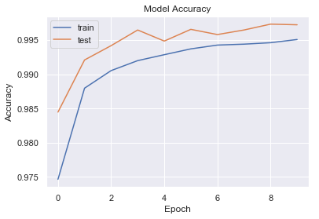

# mnist

Repository of experimentation models on the MNIST dataset. Best performing model achieved 99.7% accuracy! Data
augmentation was performed shifting all images left, right, down, and up by 1 pixel. 
The CNN was built using Keras, it's architecture is shown below:

**cnn_997: (Accuracy: 99.7%)** [cnn_997.ipynb](https://github.com/BrennoR/mnist/blob/master/cnn_997.ipynb)

Convolutional Layer - 48 filters, 2x2 kernel size, 1x1 strides, 'SAME' padding, ReLU activation\
Pooling Layer - Max activation, 2x2 pool size, 'VALID' padding\
Convolutional Layer - 96 filters, 3x3 kernel size, 1x1 strides, 'SAME' padding\
Batch Normalization\
ReLU Activation\
Pooling Layer - Max activation, 2x2 pool size, 'VALID' padding\
Flatten\
Fully Connected Layer - 1024 neurons, ReLU activation\
Dropout - 40%\
Fully Connected Layer - 1024 neurons, ReLU activation\
Dropout - 40%\
Softmax Layer - 10 nodes
   
**Accuracy vs. Number of Epochs**

As shown above, the test accuracy is oddly constantly higher than the train accuracy. This is most likely due to the dropout layers which
only take effect during training but not during validation. 
