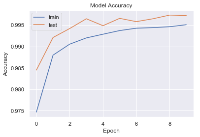

# mnist

Repository of experimentation models on the MNIST dataset. Best performing model achieved 99.4% accuracy! Data
augmentation was performed shifting all images left, right, down, and up by 1 pixel. 
The CNN was built using Keras, it's architecture is shown below:

**cnn_994: (Accuracy: 99.4%)** [cnn_994.ipynb](https://github.com/BrennoR/mnist/blob/master/cnn_994.ipynb)

Convolutional Layer - 48 filters, 2x2 kernel size, 1x1 strides, 'SAME' padding, ReLU activation\
Pooling Layer - Max activation, 2x2 pool size, 'VALID' padding\
Convolutional Layer - 96 filters, 3x3 kernel size, 1x1 strides, 'SAME' padding\
Batch Normalization\
ReLU Activation\
Pooling Layer - Max activation, 2x2 pool size, 'VALID' padding\
Flatten\
Fully Connected Layer - 1024 neurons, ReLU activation\
Dropout - 40%\
Fully Connected Layer - 1024 neurons, ReLU activation\
Dropout - 40%\
Softmax Layer - 10 nodes
   
**Accuracy vs. Number of Epochs**

